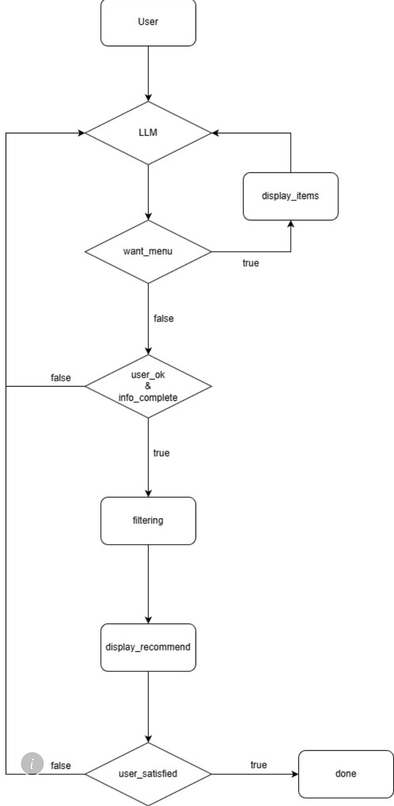
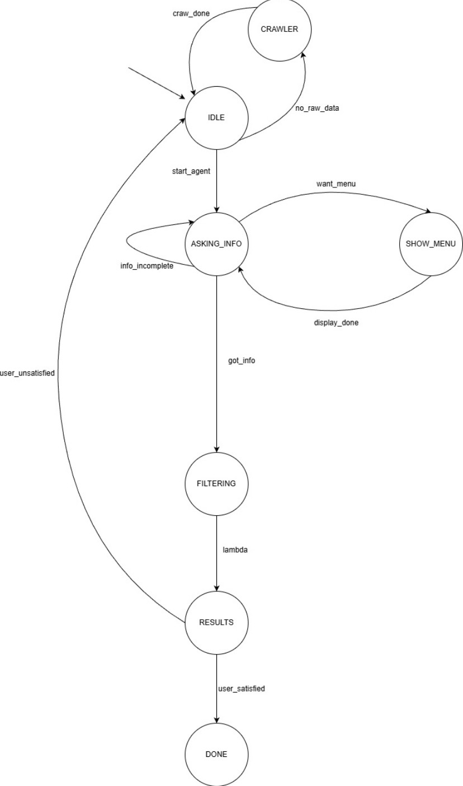

# KFC Coupon Recommendation AI Agent

> **TOC 2025 Final Project** - An intelligent conversational agent for personalized KFC coupon recommendations using FSM-based dialogue management and LLM-powered intent extraction.

---

## Table of Contents

- [Overview](#overview)
- [System Architecture](#system-architecture)
- [Tech Stack](#tech-stack)
- [Project Structure](#project-structure)
- [Installation & Usage](#installation--usage)
- [Core Implementation](#core-implementation)
- [Team Members](#team-members)

---

## Overview

This project implements an AI-powered conversational agent that helps users find the most suitable KFC coupons based on their preferences and group size. The system combines **Finite State Machine (FSM)** for dialogue flow control with **Large Language Model (LLM)** for natural language understanding, creating a robust and flexible recommendation system.

### Key Features

- **Conversational Interface**: Natural dialogue flow using FSM with 6 states
- **Dual LLM Integration**:
  - Stage 1: Automatic coupon data parsing from KFC API
  - Stage 2: Real-time user intent extraction
- **Anti-Hallucination Mechanism**: Strict prompt engineering with negative examples to prevent LLM from guessing user preferences
- **Intelligent Matching**: Synonym-aware fuzzy matching with multi-dimensional ranking (preference match → group size → price)
- **Smart Caching**: Automatic data freshness detection and update scheduling
- **Dual Interface**: Both CLI and Streamlit web UI available

---
## System Architecture

### System Flow Chart


### Finite State Machine (FSM)


**State Descriptions**:
- `IDLE`: Initial state, waiting for activation
- `CRAWLER`: Fetching data via KFC API
- `ASKING_INFO`: Collecting user preferences (group size, food items)
- `SHOW_MENU`: Display available menu items when user is uncertain
- `FILTERING`: Process coupon matching based on collected information
- `RESULTS`: Present ranked recommendations
- `DONE`: Conversation completed


### System Workflow

1. **Data Acquisition**: Fetch coupon data from KFC API
2. **LLM Parsing**: Extract structured information (name, items, price, serves) from raw HTML
3. **User Interaction**: FSM-guided conversation to collect preferences
4. **Intent Extraction**: LLM processes user input to extract:
   - Number of people (`num_people`)
   - Food preferences with synonym normalization (`preferences`)
   - Menu request flag (`want_menu`)
5. **Coupon Matching**: Fuzzy matching with scoring algorithm
6. **Result Ranking**: Sort by match score → group size fit → price

---

## Tech Stack

| Component | Technology |
|-----------|-----------|
| **Language** | Python 3.x |
| **LLM API** | Ollama (gemma3:4b model) |
| **Web Framework** | Streamlit |
| **HTTP Client** | requests |
| **Environment Config** | python-dotenv |
| **Web Scraping** | BeautifulSoup4, lxml |

---

## Project Structure

```
kfc_agent/
├── src/                      # Core modules
│   ├── __init__.py
│   ├── agent.py              # FSM-based conversation agent
│   ├── scraper.py            # KFC API crawler + LLM parser
│   ├── prompts.py            # LLM prompt templates
│   └── utils.py              # LLM API utilities
│
├── config/                   # Configuration management
│   ├── __init__.py
│   └── config.py             # Environment variables & settings
│
├── data/                     # Coupon data cache
│   ├── raw.json              # Raw API response
│   └── coupons.json          # Parsed coupon data
│
├── main.py                   # CLI entry point
├── frontend.py               # Streamlit web UI
├── requirements.txt          # Python dependencies
└── .env                      # Environment configuration
```

---

## Installation & Usage

### Prerequisites

- Python 3.8 or higher
- Access to Ollama LLM API (API key required)

### Setup

1. **Clone the repository**
   ```bash
   git clone https://github.com/DennisLee03/kfc_agent.git
   cd kfc_agent
   ```
2. **Create a Virtual Environment**
   ```bash
   python -m venv venv
   ```
3. **Start your Virtual Environment**
   ```bash
   venv\Scripts\activate.bat # in Windows's cmd
   ```
4. **Install dependencies**
   ```bash
   pip install -r requirements.txt
   ```

5. **Configure environment variables**

   Create a `.env` file in the project root:
   ```bash
   OLLAMA_API_URL=https://your-ollama-api-endpoint/api
   OLLAMA_API_KEY=your_api_key_here
   OLLAMA_MODEL=gemma3:4b
   DEBUG_MODE=false
   ```

### Running the Application

**Start your Virtual Environment first**
   ```bash
   venv\Scripts\activate.bat # in Windows's cmd
   ```

**Option 1: Command Line Interface (CLI)**
```bash
python main.py
```

**Option 2: Web Interface (Streamlit)**
```bash
streamlit run frontend.py
```

**Test LLM Connection**
```bash
python main.py --test
```

---

## Core Implementation

### 1. Two-Stage LLM Usage

**Stage 1: Coupon Data Parsing** (`src/scraper.py`)
```python
def parse_coupon_with_llm(raw_coupon: Dict) -> Optional[Dict]:
    """
    Use LLM to extract structured data from raw coupon HTML
    Input: {"items_raw": "9塊香酥炸雞桶，適合全家享用", "price": 299}
    Output: {"name": "炸雞桶 299元", "items": ["炸雞"], "serves": 3}
    """
```

**Stage 2: Intent Extraction** (`src/agent.py`)
```python
def _extract_info(self, user_input: str) -> Dict:
    """
    Extract user intent from natural language input
    Input: "3個人，想吃炸雞和蛋撻"
    Output: {"num_people": 3, "preferences": ["炸雞", "蛋撻"], "want_menu": false}
    """
```

### 2. Anti-Hallucination Mechanism

**Problem**: LLM may randomly generate food preferences not mentioned by users.

**Solution**: Strict prompt engineering (`src/prompts.py`)
- ✅ Explicit negative examples (e.g., input "45" → output `preferences: []`)
- ✅ Comprehensive synonym mapping with clear rules
- ✅ "Do NOT guess" instructions emphasized multiple times

Example prompt rules:
```
**CRITICAL RULES:**
- ONLY extract foods explicitly mentioned by the user
- NEVER guess or add items the user didn't say
- If user says numbers like "45" or "100", preferences MUST be []
- If user provides ONLY the number of people, preferences MUST be []
```

### 3. Synonym-Aware Matching

**Synonym Normalization** (LLM handles during extraction):
- `"炸雞"/"脆雞"/"辣雞"` → standardized to `["炸雞"]`
- `"雞塊"/"上校雞塊"/"nugget"` → standardized to `["雞塊"]`
- `"蛋塔"/"蛋撻"/"原味蛋撻"` → standardized to `["蛋撻"]`

**Fuzzy Matching** (in filtering algorithm):
```python
# Bidirectional substring matching
if pref in item or item in pref:
    matched_items.append(item)
```

### 4. Multi-Dimensional Ranking

Coupons are sorted by:
1. **Match Score** (descending): Number of user preferences satisfied
2. **Group Size Fit** (ascending): `|coupon.serves - num_people|`
3. **Price** (ascending): Lower price is better

```python
filtered.sort(key=lambda x: (-x["match_score"], x["people_diff"], x["price"]))
```